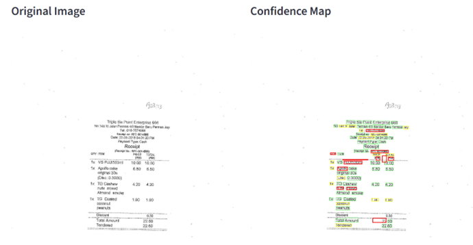
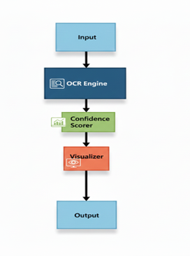

# Confidence Aware OCR Document Reader

**Author:** Shapna  
**Project Type:** Applied Machine Learning / Document AI  
**Dataset:** SROIE 2019 (Real World Scanned Receipts)  


## 1. Problem Overview

Organizations continue to process massive volumes of scanned receipts, invoices, and forms. OCR systems are widely used to automate this process, but in real world deployments, OCR output is often silently unreliable.

The core problem is not that OCR makes errors.  
**The problem is that traditional OCR systems do not communicate uncertainty.**

This creates two equally flawed workflows:

- **Blind automation:** Fast, but errors propagate unnoticed  
- **Full manual review:** Accurate, but slow, expensive, and unscalable  

In business critical domains (finance, compliance, healthcare), neither approach is acceptable.

**Key Insight:**  
Accuracy without uncertainty is risky. A practical OCR system must explicitly indicate what can be trusted and what requires human review.


## 2. Why Receipts Are a Hard OCR Problem

Receipts represent one of the most challenging document types for OCR due to:

- Crumpling, folding, and physical distortion  
- Mobile image capture (glare, blur, skew)  
- Dense numeric content (totals, taxes, SKUs)

### Example Input & Output

Sample receipt from the SROIE 2019 dataset and the corresponding confidence-aware OCR output highlighting uncertain regions.




## 3. Proposed Solution: Confidence Aware OCR

This project introduces a confidence aware OCR system that transforms OCR output from fragile automation into reliable, human guided decision support.

Instead of asking humans to review everything or trust everything, the system:

- Extracts word level OCR confidence scores  
- Categorizes text into high, medium, and low confidence  
- Visually highlights only uncertain regions  
- Directs human attention precisely where it adds value  

**Core Principle:**  
Perfect automation is unrealistic. Intelligent collaboration is achievable.


## 4. System Architecture (High Level)

The system is built as a modular pipeline with clear separation of concerns:

- **A.** OCR Engine (Tesseract 5.x)  
- **B.** Confidence Analysis Module  
- **C.** Visualization Layer  
- **D.** Evaluation Module  
- **E.** User Interface (Streamlit + CLI)  

Image Architecture of the system




## 5. Dataset & Evaluation Setup

**Dataset:** SROIE 2019 (ICDAR Competition)

- 987 real world scanned receipts  
- Ground truth text boxes and structured entities  
- Highly variable quality and layouts  

This dataset reflects actual production conditions, not clean or synthetic data.

The system was evaluated using:

- Word level accuracy  
- Confidence–error correlation  
- Field level reliability for critical values  


## 6. Reproduction and Setup

### 1:  Python Environment

Create a python environment

### 2:  Install Dependencies

```bash
pip install -r requirements.txt
streamlit run app.py
```

### 3 :  Tesseract OCR Installation

Must install separately, because it's an external dependency.

- **Windows:** download installer from UB Mannheim Tesseract and add to PATH
- **macOS:** `brew install tesseract`
- **Linux:** `sudo apt-get install tesseract-ocr`

### 4:  Dataset

Download the SROIE 2019 dataset from the following link:

**Dataset:** https://www.kaggle.com/datasets/urbikn/sroie-datasetv2?resource=download

After downloading:

- Delete the folder named `layoutlm-base-uncased` (if present).
- Copy and paste the `SROIE2019` folder into the `data` directory.

**Folder structure requirement:**

- The `SROIE2019` folder should contain only the `train` and `test` folders.
- Place the `SROIE2019` folder inside the `raw` directory as shown below:

### 5: Running the Project

**Streamlit UI:**
```bash
streamlit run app.py
```

**CLI (batch processing):**
```bash
python main.py
```

**Outputs:**
- Annotated images
- CSV / JSON summaries
- Word exports


## 6. Project Structure

```
confidence-aware-ocr/
├── data/
│   ├── raw/
│   │   └── SROIE2019/          # Dataset (not included in repo)
│   │       ├── train/
│   │       │   ├── img/        # Receipt images
│   │       │   ├── box/        # Ground truth text boxes
│   │       │   └── entities/   # Ground truth structured data
│   │       └── test/
│   ├── processed/              # Processed data
│   └── results/                # Output files
│       ├── visualizations/     # Annotated images
├── src/
│   ├── data_loader.py          # Dataset loading utilities
│   ├── ocr_engine.py           # Tesseract OCR wrapper
│   ├── confidence_scorer.py    # Confidence analysis
│   ├── visualizer.py           # Image annotation
│   └── evaluator.py            # Accuracy evaluation
├── app.py                      # Streamlit web interface
├── main.py                     # CLI pipeline
├── requirements.txt            # Python dependencies
├── .gitignore                  # Git ignore rules
└── README.md                   # This file
```


## 7. Key Results

### Confidence Predicts Reliability

| Confidence Level | Accuracy | Interpretation       |
|------------------|----------|----------------------|
| High (≥80%)      | 94%      | Safe to trust        |
| Medium (60–79%)  | 72%      | Context dependent    |
| Low (<60%)       | 40%      | Requires review      |

Low confidence words are ~2.4× more likely to be incorrect than high confidence words.

This validates the core hypothesis:

**OCR confidence scores provide a strong, actionable signal for selective human review.**


## 8. Limitations

- Confidence scores are not calibrated probabilities
- English language focus (multilingual extension possible)
- Streamlit not intended for enterprise scale throughput


## 9. Conclusion

The Confidence Aware OCR Document Reader demonstrates that the real challenge in document AI is not extraction, but trust.

By making uncertainty explicit and actionable, this system:

- Reduces silent OCR failures
- Focuses human effort where it matters
- Bridges the gap between automation and reliability

